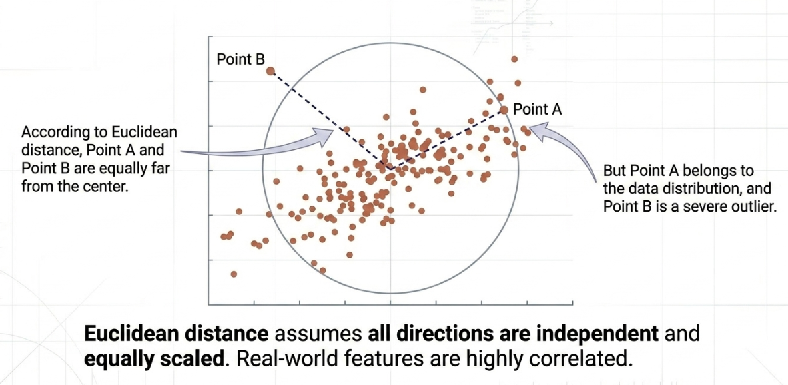
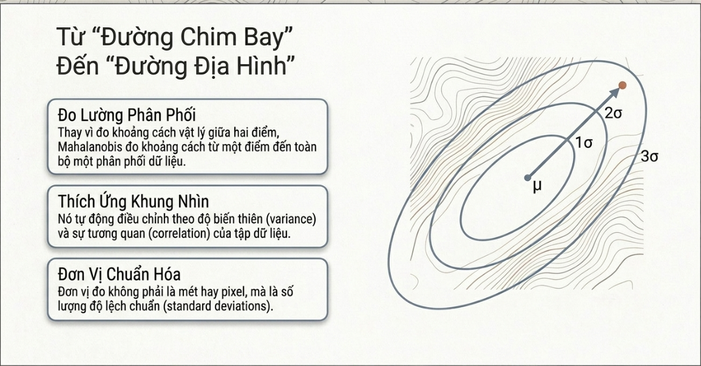
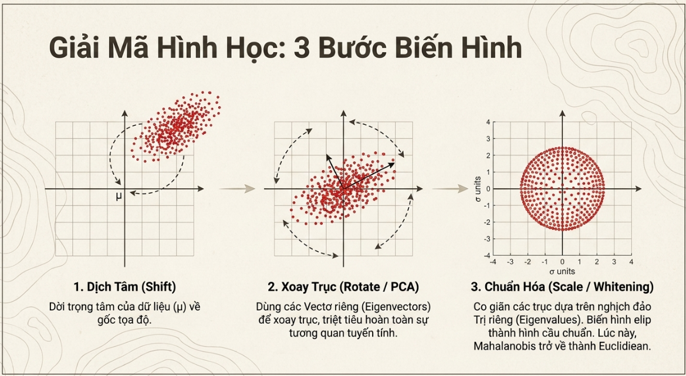

# Mahalanobis Distance

## Nhược điểm của khoảng cách Euclidean

Euclidean ngầm định rằng tất cả các chiều dữ liệu đều độc lập và có cùng phương sai, điều hầu như không bao giờ đúng trong thực tế.

## Ma trận hiệp phương sai (Covariance Matrix)

Covariance Matrix thường được ký hiệu là $\Sigma$, là một ma trận vuông kích thước $d\times d$ với $d$ là số chiều dữ liệu.

Covariance Matrix dùng để đo lường mức độ đồng biến thiên giữa các cặp đặc trưng trong không gian đa chiều.

### Công thức lý thuyết với biến ngẫu nhiên

Giả sử có một biến ngẫu nhiên $X=(X1, X2, \dots,X_d)^T$. Kỳ vọng của nó là một vector $\mu=(\mu_1,\mu_2,\dots,\mu_d)^T$. Ma trận hiệp phương sai $\Sigma$ được định nghĩa bằng kỳ vọng của tích các độ lệch so với trung bình:
$$ \Sigma = \mathbb{E}[(X-\mu)(X-\mu)^T]$$

- Đường chéo chính của ma trận này là phương sai của từng chiều riêng lẻ.
- Các phần tử ngoài đường chéo chứa hiệp phương sai giữa 2 chiều, thể hiện chúng đồng biến, nghịch biến hay độc lập.

### Cách tính trên một tập điểm dữ liệu (Data Sample)

Giả sử có ma trận dữ liệu $X\in \mathbb{R}^{d\times n}$ gồm $n$ điểm dữ liệu, mỗi điểm có $d$ chiều.

Việc tính toán ma trận hiệp phương sai $\Sigma$ gồm các bước sau:

1. **Tính vector trung bình**: Cho từng chiều i, tính
$$ \mu_i = \frac{1}{n}\sum_{j=1}^n x_{ij}$$
2. **Định tâm dữ liệu**: Lấy mỗi điểm dữ liệu trừ đi vector trung bình để dời trọng tâm về gốc tọa độ. Ta được ma trận dữ liệu đã định tâm $\tilde{X}$.
3. **Tính từng phân tử của ma trận hiệp phương sai**: Phần tử hàng $i$, cột $j$:
$$ c_{ij} = \frac{1}{n}\sum_{l=1}^n (x_{il}-\mu_i)(x_{jl}-\mu_j) $$
    Trong thống kê, để có unbiased, thường dùng $n-1$ thay vì $n$

Có thể dùng dạng thu gọn $\Sigma=\frac{1}{n}\tilde{X}\tilde{X}^T$.

## Khoảng cách Mahalanobis

Khoảng cách Mahalanobis **tích hợp cấu trúc hiệp phương sai (covariance)** của tập dữ liệu vào phép đo, giúp đánh giá khoảng cách từ một điểm đến trung tâm của một phân phối xác suất.

Mahalanobis sẽ thực hiện chuỗi biến đổi:
1. Tịnh tiến gốc tọa độ về trung tâm dữ liệu.
2. Xoay các trục tọa độ dọc theo các chiều có phương sai lớn nhất (vector riêng) và co giãn các trục này theo phương sai của chúng.
3. Phép biến đổi này "bóp" hình elip thành 1 hình cầu.

Do quá trình trên, khoảng cách Mahalanobis hoàn toàn **không phụ thuộc vào đơn vị đo lường (scale-invariant)** và triệt tiêu sự tương quan tuyến tính giữa các đặc trưng.

Công thức:

$$d_M(x, y) = \sqrt{(x-y)^T\Sigma^{-1}(x-y)}$$

trong đó $\Sigma^-1$ là ma trận nghịch đảo hiệp phương sai.

*Chú ý*: Khoảng cách Mahalanobis là một thức đo **data-dependent**. Phải có một tập dữ liệu nền hoặc một phân phối xác suất trước.

## Tính tương đối của Mahalanobis

Mahalanobis thực chất đánh giá xem một điểm mới (test point) *thuộc về* một tập dữ liệu ở mức độ nào.

Ví dụ, trong bài toán phân loại đa lớp (chó, mèo, chuột), mỗi lớp động vật sẽ có một đặc thù phân bố dữ liệu khác nhau.

Nếu dùng một thước đo khoảng cách chung cho mọi lớp, chúng ta đang ngầm định chúng có độ phân tán giống nhau (hình cầu chuẩn).
Lúc này, ma trận hiệp phương sai đóng vài trò làm *hệ quy chiếu* riêng cho từng lớp.

Cuối cùng, ta ***chọn khoảng cách điểm test point tới lớp gần nhất*** (chính là maximum likelihood)

Quá trình phân loại thường diễn ra như sau:

- Huấn luyện: Với mỗi lớp $i$, tính $\mu_i$ và $\Sigma_i$ (trung bình và hiệp phương sai) dựa trên các mẫu đã biết.
- Test: Khi có test point mới, hệ thống dùng khoảng cách của từng lớp để tính khoảng cách đến tâm phân phối từng lớp.
- Decision: Điểm dữ liệu được xếp vào lớp có khoảng cách Mahalanobis nhỏ nhất, hay được xếp vào lớp mà điểm đó nằm sâu nhất trong "vùng ảnh hưởng của phân phối". 

Đây là nền tảng của:

- Supervised Classification
- Fisher's linear discriminant analysis
- Pattern Recognition

