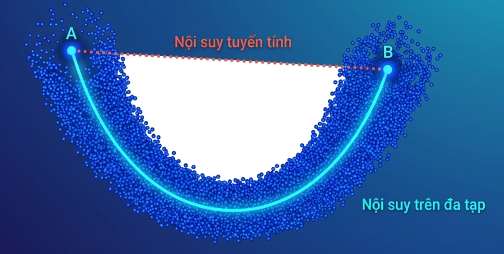
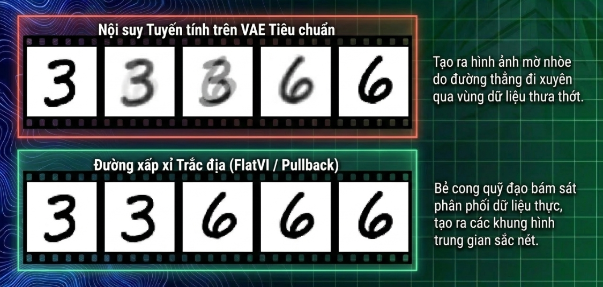

# Geosedic 

## Đường trắc địa (Geosedic)

Đường trắc địa là đường cong có độ dài ngắn nhất kết nối hai điểm và nằm hoàn toàn trên một manifold.

Trong không gian bao quanh (ambient space - thường là Euclidean), khoảng cách ngắn nhất giữa hai điểm luôn là một đường thẳng. Tuy nhiên, các đa tạp lại là các cấu trúc hình học phi tuyến bị uốn cong, do đó một đường thẳng thông thường nối hai điểm trên đa tạp sẽ đam xuyên khỏi bề mặt của nó.

## Hệ quả với phép nội suy (Interpolation)

Sự khác biệt giữa đường thẳng và đường trắc địa dẫn đến các hệ quả cực kỳ quan trọng trong toán học và các mô hình học sâu như VAE và GAN.

1. **Nội suy hình học không thể dùng phép cộng tuyến tính (LERP)**: Phép cộng 2 phân tử trên đa tạp chưa chắc tạo ra điểm trên đa tạp.
2. **Hiện tượng vượt qua các vùng "vô nghĩa" trong Latent Space**: Trong học sâu, decoder, bóp méo latent space để khớp với phân phối thực tế, khiến cho không gian có tính chất phi Euclidean. Nếu di chuyển bằng đường thẳng thì nó có thể đi xuyên qua các vùng có mật độ dữ liệu cực thấp hoặc nằm ngoài đa tạp.
3. **Tạo ra trạng thái nội suy dị thường và phi thực tế**: Hệ quả là mô hình tạo ra đầu ra bất hợp lý (như ảnh mờ trong các bài tái tạo, hay các tư thế kỳ dị trong robotics).

## Giải pháp nội suy bằng đường trắc địa:

1. Sử dụng quy trình 2 bước:
    - Dùng *Logarithmic map* để tính toán một vector tiếp tuyến chỉ hướng từ điểm xuất phát tới điểm đích.
    - Dùng *Exponential map* để di chuyển một khoảng cách tương ứng dọc theo đường trắc địa dựa trên vector tiếp tuyến đó. 
    - Công thức nội suy: $[Y(t)] := \text{Exp}_{[Y_0]}\left(t\cdot \text{Log}_{[Y_0]}([Y_1])\right)$

2. Dùng *Pullback Metric*
3. Làm phẳng Latent Space (FlatVI)

---

## Liên quan

- [Pullback Metric](06-pullback-metric.md) — cách đo độ dài đường trên đa tạp ẩn để tìm geodesic.
- [FlatVI](07-flatvi.md) — làm phẳng không gian để geodesic ≈ đường thẳng (lerp).
- [Giả thuyết Đa tạp](03-manifold-hypothesis.md) — geodesic là khái niệm trên manifold.
- [Hình học Riemannian](../../03-geometry-structure/research/04-riemannian-geometry.md) — exp/log map, độ cong.
- [Slerp](../../03-geometry-structure/research/05-slerp.md) — geodesic dạng đóng trên mặt cầu.

## Tham khảo

- Arvanitidis, Hansen, Hauberg, *Latent Space Oddity: on the Curvature of Deep Generative Models* (ICLR 2018, arXiv:1710.11379).
- Shao, Kumar, Fletcher, *The Riemannian Geometry of Deep Generative Models* (CVPR Workshops, 2018).
- do Carmo, M., *Riemannian Geometry* (Birkhäuser, 1992) — geodesic, exponential/logarithmic map.